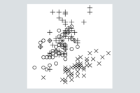

# Good Plot Symbols

Preattentive features are detected quickly, before normal visual processing takes place.  Preattentive features include closure, line orientation, and terminators.

Symbols with preattentive features improve pattern detection in plots by increasing discriminability and reducing overlap.  These symbols have been [contributed to d3](https://github.com/d3/d3-shape/releases).

[This project demonstrates plot symbols with preattentive features that improve usability.](https://hemanrobinson.github.io/good-plot-symbols/)

