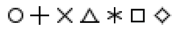

# Preattentive Plot Symbols

Symbols with preattentive features improve pattern detection in plots by increasing discriminability and reducing overlap.  These symbols have been [contributed to d3](https://github.com/d3/d3-shape/releases).

Preattentive features are detected quickly, before normal visual processing takes place.  Preattentive features include closure, line orientation, and terminators.

[This project demonstrates popular symbols with preattentive features to improve pattern detection.](https://hemanrobinson.github.io/preattentive/)

This project uses [d3](https://github.com/d3/d3) and [Material-UI](https://github.com/mui-org/material-ui), and was bootstrapped with [Create React App](https://github.com/facebook/create-react-app).
